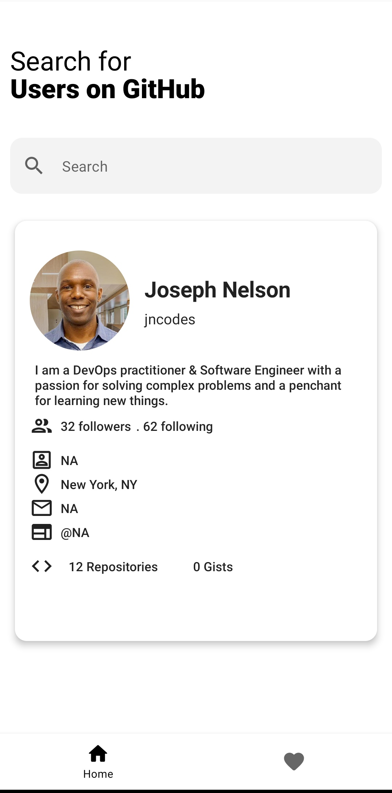
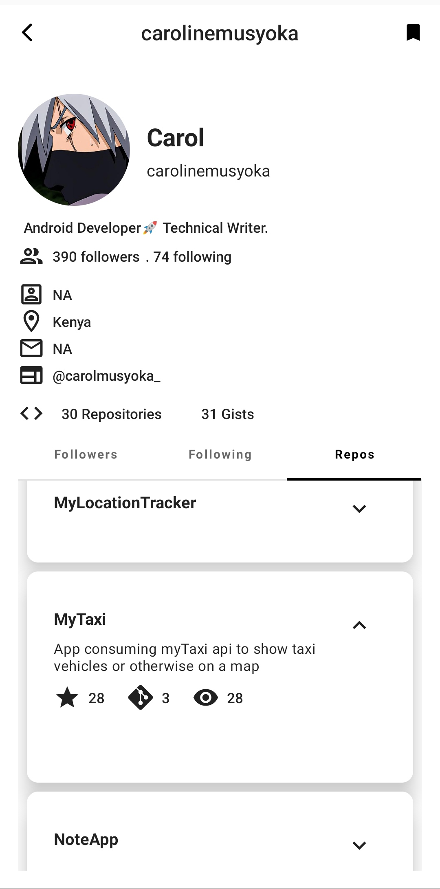

# Git App

An Android application consuming the [GitHub API](https://developer.github.com/v3/) to search for users on Github, display their followers, following and repositories. The project is
built with Compose, MVVM pattern as well as other architectural components and libraries.

## Table of Contents
- [Installation](#installation)
- [UserFlow](#userflow)
- [Architecture](#architecture)
- [Libraries](#libraies)

## Installation

This project uses the Gradle build system. To build this project, use the
`gradlew build` command or use "Import Project" in Android Studio.

_You can find the latest apk in the Release section, or you can download from [here]()_

## UserFlow
The app shows a search screen, on the home page with a search bar. A user is able to search for a user using their username. The app displays the user's profile. When a user clicks on the profile, the app navigates to a detail screen, which displays the user's followers, following and repositories.
When a user clicks on a repository, they are able to view the repository's description, stars, fork and watchers count and the topics under the repository.

   
   
   

## Architecture
The app is built using the MVVM architectural pattern. The app has composable screens that communicates to ViewModel which in turn communicates to
the usecase which communicates with Repository to get data.

## Libraries
- [Jetpack](https://developer.android.com/jetpack)🚀
    - [Viewmodel](https://developer.android.com/topic/libraries/architecture/viewmodel) - Manage UI
      related data in a lifecycle conscious way
    - [Compose](https://developer.android.com/courses/pathways/compose) - A modern declarative way
      to build android ui
    - [Navigation](https://developer.android.com/jetpack/compose/navigation) - Handle everything needed for in-app navigation.
    - [ViewModel](https://developer.android.com/jetpack/compose/state#viewmodel-state) - Easily schedule asynchronous tasks for optimal execution.
    - [Room](https://developer.android.com/topic/libraries/architecture/room) - Persistence library for Android.
- [Retrofit](https://square.github.io/retrofit/) - Type-safe HTTP client and supports coroutines out
  of the box. Used for the network calls.
- [Gson](https://github.com/google/gson) - Used to convert JSON to Java/Kotlin classes for the
  Retrofit
- [Lottie Animation Library](https://lottiefiles.com/) - A library for creating animated views and animations.
- [Accompanist Library](https://github.com/google/accompanist) - A library for building Android apps with
  the Jetpack Compose framework.
- [okhttp-logging-interceptor](https://github.com/square/okhttp/blob/master/okhttp-logging-interceptor/README.md)
    - logs HTTP request and response data.
- [kotlinx.coroutines](https://github.com/Kotlin/kotlinx.coroutines) - Library Support for
  coroutines
- [Hilt](https://developer.android.com/training/dependency-injection/hilt-android) - Used for
  Dependency injection
- [Coil](https://coil-kt.github.io/coil/compose/) - Allows for fetching and displaying of images in
  the composables
